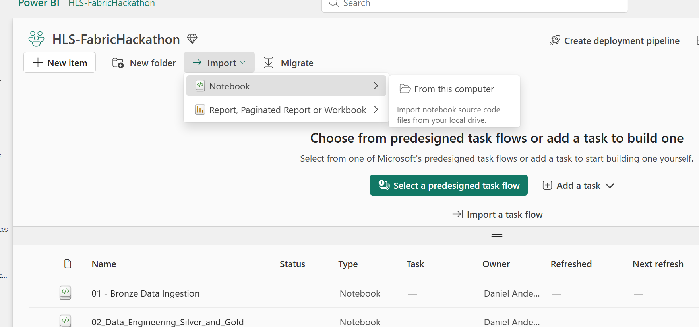
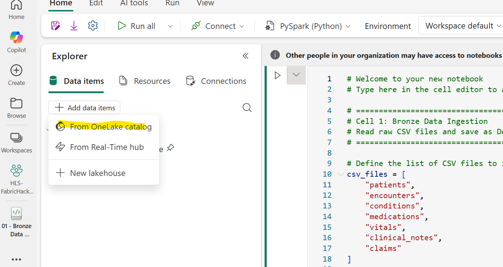

# Module 2: Data Engineering — Silver & Gold Layers

| Duration | 30 minutes |
|----------|------------|
| Objective | Transform Bronze data into cleansed Silver tables and compute Gold-layer healthcare analytics |
| Fabric Features | Spark Notebooks, Delta Tables, SQL Analytics |

---

## What You Will Do

In this module, you will:
1. Create **Silver layer** tables — cleansed, validated, and properly typed data
2. Create **Gold layer** tables — business-ready analytics tables including:
   - 30-day hospital readmission calculations
   - Average Length of Stay (ALOS) by diagnosis
   - ED frequent flyer identification
   - Patient risk stratification
   - Claims denial analysis

---

## Step 1: Import the Data Engineering Notebook

Instead of creating a notebook from scratch and pasting code cell-by-cell, we've provided a single notebook that contains all Silver and Gold layer transformations with detailed markdown explanations for each step.

1. Download the notebook file from the GitHub repo:
   - Go to **`notebooks/02_Data_Engineering_Silver_and_Gold.ipynb`** in the repository
   - Click **Download** (or use the raw file link)

2. In your Fabric workspace, click **Import** → **Notebook** → **From this computer**

3. Select the downloaded `.ipynb` file and click **Upload**

4. Open the imported notebook

### Step 2: Attach the Lakehouse

1. In the **Explorer** pane on the left, click **Add data items** → **From OneLake catalog**

2. Search for `HealthcareLakehouse`
3. ⚠️ You will see **two items** with the same name. One is the **Lakehouse** and the other is the **SQL Analytics Endpoint**. **Select the Lakehouse** (blue house/database icon). Click on the item details if needed to confirm the type is **Lakehouse**, not SQL Analytics Endpoint.
4. Click **Add**

### Step 3: Run the Notebook

1. Click **▶ Run all** at the top of the notebook
2. The notebook will process all Silver and Gold tables end-to-end (~5 minutes)
3. Each cell has detailed markdown above it explaining:
   - **Business context** — why this metric matters in healthcare
   - **Technical approach** — what the PySpark code does and why

> ⚠️ **Session Note:** If your Spark session expires or is stopped at any point, you will need to re-run all cells from the top using **Run all**. Fabric does not preserve variables, imports, or DataFrames across session restarts.

### What the Notebook Creates

**Part A — Silver Layer** (cleansed, typed, standardized):
- `silver_patients` — Age groups, risk categories
- `silver_encounters` — Date parsing, LOS categories, temporal dimensions
- `silver_conditions` — ICD-10 → clinical category mapping
- `silver_claims` — Payment ratio, denial flag
- `silver_medications` — Parsed dates
- `silver_vitals` — Numeric casting, SIRS sepsis flag
- `silver_clinical_notes` — Parsed dates

**Part B — Gold Layer** (business-ready KPIs):
- `gold_readmissions` — 30-day readmission rate (CMS HRRP measure)
- `gold_ed_utilization` — ED frequent flyers (4+ visits/year)
- `gold_alos` — Average length of stay by diagnosis & facility
- `gold_encounter_summary` — Denormalized fact table for Power BI
- `gold_financial` — Revenue, denials, collections by payer
- `gold_population_health` — Chronic disease prevalence & multimorbidity

---

## Step 4: Verify Your Tables

Go back to your `HealthcareLakehouse` and refresh the Tables section. You should now have the following tables:

**Gold Tables:**
| Table | Description | Key Metric |
|-------|-------------|------------|
| `gold_readmissions` | 30-day readmission tracking | Readmission rate % |
| `gold_ed_utilization` | ED visit patterns per patient | Frequent flyer count |
| `gold_alos` | Avg length of stay by diagnosis/facility | ALOS days |
| `gold_encounter_summary` | All encounters with demographics | Volume trends |
| `gold_financial` | Claims with denial analysis | Denial rate %, collection rate |
| `gold_population_health` | Patient chronic condition profile | Multimorbidity, prevalence |

**Silver Tables:**
| Table | Description |
|-------|-------------|
| `silver_patients` | Cleansed patients with age groups and risk categories |
| `silver_encounters` | Encounters with computed month, LOS categories |
| `silver_conditions` | Conditions with clinical categories |
| `silver_claims` | Claims with payment ratios |
| `silver_medications` | Medications with proper dates |
| `silver_vitals` | Vitals with SIRS flag |
| `silver_clinical_notes` | Clinical notes with proper dates |

---

## 💡 Discussion: Why These Metrics Matter

Take a moment to discuss with your table:

1. **Readmission Rate:** Your hospital's rate is around 15%. The national average is similar. What would a 1% reduction mean in CMS penalty savings?
2. **ED Frequent Flyers:** These patients often have unmanaged chronic conditions. How could proactive outreach reduce ED burden?
3. **ALOS:** Sepsis patients stay much longer than average. What does this mean for bed capacity and staffing?
4. **Denial Rates:** Notice how Medicare Advantage denial rates are higher than traditional Medicare. What administrative costs does this create?

---

## ✅ Module 2 Checklist

Before moving to Module 3, confirm:

- [ ] Notebook imported and Lakehouse attached
- [ ] All cells ran successfully (Run all)
- [ ] 7 Silver tables created and populated
- [ ] 6 Gold tables created with computed metrics
- [ ] Readmission rates are being calculated correctly (~15%)
- [ ] You can see ED frequent flyer patients identified
- [ ] Financial denial analysis shows payer-level differences

---

**[← Module 1: Setup & Ingestion](Module01_Setup_and_Data_Ingestion.md)** | **[Module 3: Semantic Model & Dashboard →](Module03_Semantic_Model_and_Dashboard.md)**
