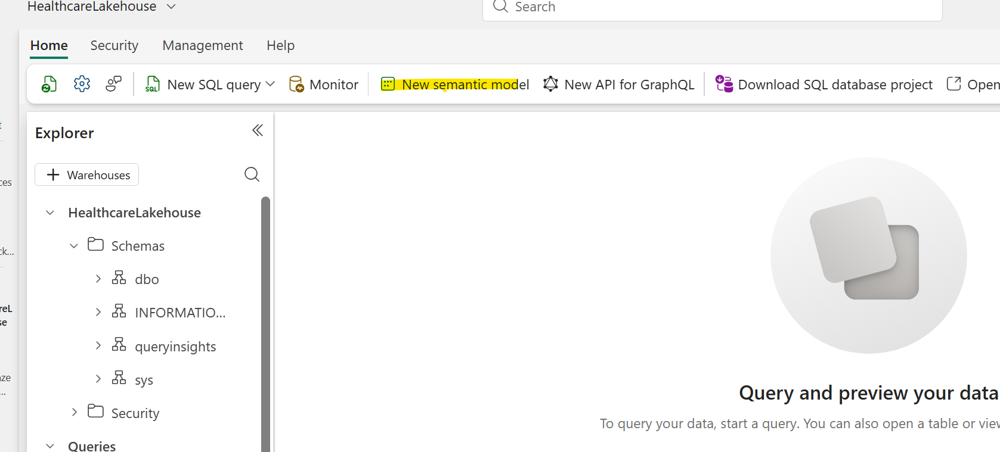
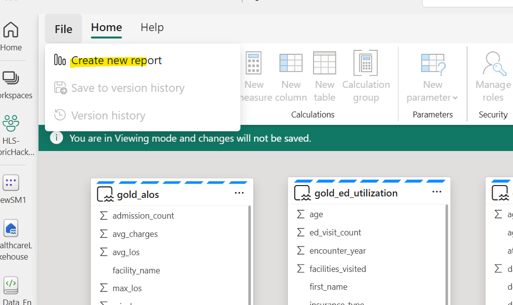
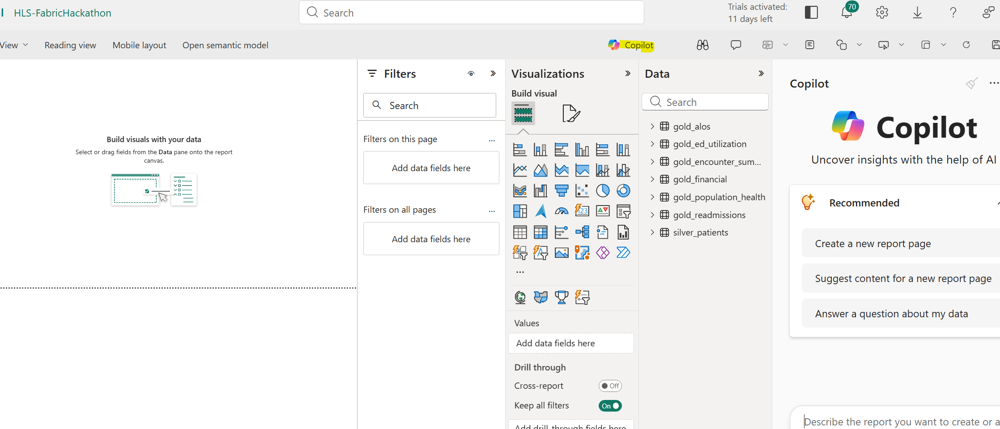
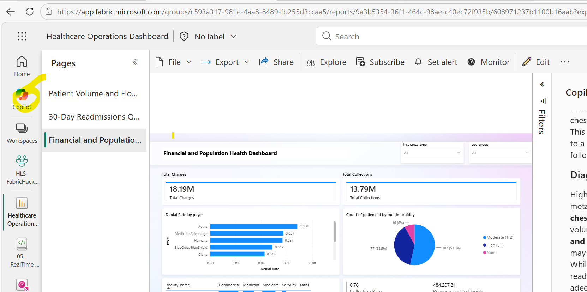

# Module 3: Semantic Model, Dashboard & Power BI Copilot

| Duration | 45 minutes |
|----------|------------|
| Objective | Build a star-schema Semantic Model on Gold tables, create an interactive Power BI dashboard, and explore Power BI Copilot for AI-powered insights and causal analysis |
| Fabric Features | Semantic Model, Power BI Report, DAX Measures, Power BI Report Copilot, Power BI Reading View Copilot |

---

## What You Will Do

In this module, you will:
1. Create a **Semantic Model** (star schema) on your Gold layer tables
2. Define **DAX measures** for readmission rate, ALOS, and financial KPIs
3. Build a **Power BI report** with three pages:
   - Page 1: Patient Volume & Flow
   - Page 2: Quality & Readmissions
   - Page 3: Population Health & Financials

---

## Part A: Create the Semantic Model

### Step 1: Navigate to the SQL Analytics Endpoint

To create a semantic model with the ability to select tables, you must start from the **SQL Analytics Endpoint** — not the Lakehouse view directly.

1. Open your **HealthcareLakehouse** in the Fabric portal
2. In the top-right corner of the Lakehouse view, click the dropdown that says **Lakehouse** and switch to **SQL analytics endpoint**
3. You should now see the SQL endpoint view with your tables listed in the left panel



> ⚠️ **Important:** If you try to create a semantic model directly from the Lakehouse view, you may not be able to select individual tables. Always switch to the **SQL analytics endpoint** first.

### Step 2: Create a New Semantic Model

1. In the **SQL analytics endpoint** view, click **New semantic model** in the top toolbar
2. Give it a name: **HealthcareLakehouse-SemanticModel** (or keep the suggested name)
3. For **Storage mode**, select **Direct Lake on SQL**


> **Note:** When creating the semantic model from the SQL analytics endpoint, choose **Direct Lake on SQL**. This mode reads the tables through the SQL analytics endpoint layer, which ensures reliable table discovery and query routing for Lakehouse tables.

### Step 3: Select Tables for the Model

You'll be prompted to select which Lakehouse tables to include in the semantic model:

1. Check the following **Gold tables**:
   - ✅ `gold_encounter_summary`
   - ✅ `gold_readmissions`
   - ✅ `gold_ed_utilization`
   - ✅ `gold_financial`
   - ✅ `gold_population_health`
   - ✅ `gold_alos`
2. Also include this Silver table for dimension lookups:
   - ✅ `silver_patients`
3. Click **Confirm**

The semantic model opens in the **Model view** (diagram view) where you can see your selected tables.

### Step 4: Create Relationships

> ⚠️ **Important:** Before creating relationships, make sure the semantic model is in **Edit mode**. Look at the top-right corner — if you see **Viewing**, click the pencil icon and select **Editing** to switch to edit mode. You should see the toolbar options change (e.g., **New measure**, **Manage relationships** become available).


Create the following relationships:

| From Table | From Column | To Table | To Column | Cardinality |
|------------|-------------|----------|-----------|-------------|
| `gold_encounter_summary` | `patient_id` | `silver_patients` | `patient_id` | Many-to-One |
| `gold_readmissions` | `patient_id` | `silver_patients` | `patient_id` | Many-to-One |
| `gold_financial` | `encounter_id` | `gold_encounter_summary` | `encounter_id` | One-to-One |
| `gold_ed_utilization` | `patient_id` | `silver_patients` | `patient_id` | Many-to-One |
| `gold_population_health` | `patient_id` | `silver_patients` | `patient_id` | One-to-One |

**To create relationships using Manage Relationships:**

1. In the toolbar, click **Manage relationships**


2. Click **New relationship**
3. In the **New relationship** dialog:
   - Select the **From table** (e.g., `gold_encounter_summary`)
   - Select the **From column** (e.g., `patient_id`)
   - Select the **To table** (e.g., `silver_patients`)
   - Select the **To column** (e.g., `patient_id`)
   - Set the **Cardinality** (e.g., Many to one)
   - Leave **Cross-filter direction** as **Single**
   - Check **Make this relationship active**
   - Check **Assume referential integrity**
4. Click **OK** to create the relationship
5. Repeat for each relationship in the table above


> **Tip:** Using **Manage relationships** lets you create all relationships in one place without dragging columns across the diagram.

### Step 5: Create DAX Measures

Now we'll add business measures using DAX (Data Analysis Expressions). These measures calculate KPIs that update dynamically based on filters.

1. Click on the `gold_readmissions` table
2. Right-click the table name (or click the **...** menu on the table) and select **New measure**


3. Enter each measure below, clicking **New measure** for each one:

#### Readmission Measures (on `gold_readmissions` table)

**Measure 1: Readmission Rate**
```dax
Readmission Rate = 
DIVIDE(
    COUNTROWS(FILTER(gold_readmissions, gold_readmissions[was_readmitted] = TRUE())),
    COUNTROWS(gold_readmissions),
    0
)
```
> Format this measure as **Percentage** with 1 decimal place.

**Measure 2: Total Readmissions**
```dax
Total Readmissions = 
COUNTROWS(FILTER(gold_readmissions, gold_readmissions[was_readmitted] = TRUE()))
```

**Measure 3: Total Index Admissions**
```dax
Total Index Admissions = COUNTROWS(gold_readmissions)
```

#### Encounter Measures (on `gold_encounter_summary` table)

Click on the `gold_encounter_summary` table, then create these measures:

**Measure 4: Total Encounters**
```dax
Total Encounters = COUNTROWS(gold_encounter_summary)
```

**Measure 5: ED Visits**
```dax
ED Visits = 
COUNTROWS(FILTER(gold_encounter_summary, gold_encounter_summary[encounter_type] = "ED"))
```

**Measure 6: Inpatient Admissions**
```dax
Inpatient Admissions = 
COUNTROWS(FILTER(gold_encounter_summary, gold_encounter_summary[encounter_type] = "Inpatient"))
```

**Measure 7: Average Length of Stay**
```dax
Avg Length of Stay = 
CALCULATE(
    AVERAGE(gold_encounter_summary[length_of_stay_days]),
    gold_encounter_summary[encounter_type] = "Inpatient",
    gold_encounter_summary[length_of_stay_days] > 0
)
```

#### Financial Measures (on `gold_financial` table)

Click on the `gold_financial` table:

**Measure 8: Total Charges**
```dax
Total Charges = SUM(gold_financial[claim_amount])
```

**Measure 9: Total Collections**
```dax
Total Collections = SUM(gold_financial[paid_amount])
```

**Measure 10: Collection Rate**
```dax
Collection Rate = 
DIVIDE(
    SUM(gold_financial[paid_amount]),
    SUM(gold_financial[claim_amount]),
    0
)
```
> Format as Percentage.

**Measure 11: Denial Rate**
```dax
Denial Rate = 
DIVIDE(
    COUNTROWS(FILTER(gold_financial, gold_financial[claim_status] = "Denied")),
    COUNTROWS(gold_financial),
    0
)
```
> Format as Percentage.

**Measure 12: Revenue Lost to Denials**
```dax
Revenue Lost to Denials = 
CALCULATE(
    SUM(gold_financial[claim_amount]),
    gold_financial[claim_status] = "Denied"
)
```

---

## Part B: Build the Power BI Report Using Copilot

Instead of manually building each visual, use **Power BI Copilot** to generate report pages using natural language prompts. This is faster and demonstrates the AI-assisted analytics experience.

### Prerequisites
- Power BI Copilot must be enabled in your Fabric tenant (your admin may need to enable this in the Admin Portal → Tenant settings → Copilot)
- Your semantic model must have tables and measures already created (complete Part A first)

### Step 6: Create a New Report and Open Copilot

1. From the Semantic Model view, click **File** → **Create new report**



2. You will be taken to the Power BI report editor
3. In the report editor, look for the **Copilot** icon in the toolbar (it looks like a sparkle ✨)
4. Click it to open the Copilot pane on the right side



> **Note:** If you don't see the Copilot icon, Copilot may not be enabled for your tenant. Use the **Alternate Path** (manual approach) below instead.

### Step 7: Generate Page 1 — Patient Volume & Flow

In the Copilot chat pane, type the following prompt:

```
Create a dashboard page showing patient volume and flow for our hospital system. Include:
- KPI cards for Total Encounters, ED Visits, Inpatient Admissions, and Average Length of Stay
- A line chart showing monthly encounter volume trends by encounter type 
- A bar chart showing encounters by facility name
- Slicers for facility name, encounter year, and insurance type
Use the gold_encounter_summary table and related measures.
```

Review what Copilot generates. You can refine by asking:

```
Change the line chart to show the last 12 months only.
```

### Step 8: Generate Page 2 — Quality & Readmissions

Add a new page, then prompt Copilot:

```
Create a quality metrics page focused on 30-day hospital readmissions. Include:
- KPI cards for Readmission Rate (as percentage), Total Readmissions, and Total Index Admissions
- A bar chart showing readmission rate by diagnosis (index_diagnosis)
- A column chart comparing readmission rates across facilities (index_facility)
- A detail table with index diagnosis, total admissions, readmissions, and readmission rate
- Slicers for index_facility and encounter_year
Use the gold_readmissions table and readmission measures.
```

### Step 9: Generate Page 3 — Financials & Population Health

Add a new page, then prompt Copilot:

```
Create a financial and population health dashboard page. Include:
- KPI cards for Total Charges, Total Collections, Collection Rate, and Revenue Lost to Denials
- A bar chart of denial rate by payer from gold_financial table 
- A pie chart showing multimorbidity distribution (None, Moderate, High) from gold_population_health
- A matrix showing collection rate by facility and payer type
- Slicers for age group, insurance type, and gender
```

### Copilot Tips

| Do | Don't |
|----|-------|
| Reference specific table and column names | Use vague terms like "the data" |
| Ask for one page at a time | Try to generate the entire report in one prompt |
| Specify chart types explicitly | Let Copilot guess which visual to use |
| Refine iteratively with follow-up prompts | Start over if the first result isn't perfect |
| Mention your measures by name | Expect Copilot to know your custom DAX measures |

> **Key Takeaway:** Copilot is excellent for rapid prototyping and getting 80% of the way there. You'll typically still need to fine-tune layouts, conditional formatting, and interactions manually.

### Step 10: Save the Report

1. Click **File** → **Save**
2. Name: `Healthcare Operations Dashboard`
3. Save to your workspace

---

## Part D: Power BI Report Copilot

Now that your report is saved, let's test the **Report Copilot** — the AI assistant built into the Power BI report editor that can answer questions, summarize pages, and generate narrative insights from your data.

### Step 11: Open Copilot in Edit Mode

1. Open the `Healthcare Operations Dashboard` report you just saved
2. Click **Edit** to enter the report editor
3. Click the **Copilot** button in the top ribbon — the Copilot pane opens on the right

> **Note:** Report Copilot requires Fabric capacity (F64 or higher) and must be enabled by your admin. If you don't see the Copilot button, check with your instructor.

### Step 12: Try These Prompts

Test each prompt in the Copilot pane and observe how it uses your semantic model:

#### Prompt 1: Summarize the Current Page
```
Summarize the key insights from this report page
```
**What to observe:** Copilot reads the visuals on the current page and generates a narrative summary — great for quick meeting prep or briefing stakeholders.

#### Prompt 2: Ask a Data Question
```
What is our overall 30-day readmission rate and how does it compare across facilities?
```
**What to observe:** Copilot returns a data-driven answer using your readmission measures. It understands relationships between tables and can aggregate across dimensions.

#### Prompt 3: Identify Patterns and Correlations
```
Which diagnoses have the highest readmission rates, and are there patterns in patient demographics that correlate with higher readmissions?
```
**What to observe:** Copilot goes beyond simple aggregation — it identifies which categories are outliers and surfaces relationships between dimensions (diagnosis × demographics), showing AI's ability to surface non-obvious patterns.

#### Prompt 4: Request a Board-Ready Narrative
```
Write an executive summary for the hospital board covering our quality performance: readmission rates, average length of stay, and financial impact of denials. Include which areas need intervention.
```
**What to observe:** Copilot generates executive-level narrative text with actionable recommendations — demonstrating AI's ability to synthesize multiple metrics into coherent strategy guidance.

#### Prompt 5: Root Cause Exploration
```
What factors distinguish patients who are readmitted within 30 days from those who are not? Consider diagnosis, length of stay, and facility.
```
**What to observe:** Copilot performs comparative analysis across multiple dimensions to identify distinguishing characteristics — this is causal reasoning that would take an analyst significant time to perform manually.

> **Report Copilot Tips:**
> - Reference specific table and column names for better results
> - Ask for one thing at a time — don't combine multiple requests
> - Report Copilot excels at summarization, Q&A, and narrative generation
> - For visual creation, be specific about chart type and columns

---

## Part E: Standalone Copilot Experience in Power BI

The **Standalone Copilot** is a full-screen, cross-item AI experience accessed from the Power BI left navigation bar. Unlike the report-scoped Copilot in Parts B and D, the Standalone Copilot can find and answer questions across **any report, semantic model, or Fabric data agent** you have access to — without requiring you to open a specific report first. It automatically identifies the best data source for your question, generates visuals on demand, creates new DAX calculations, and delivers advanced analytical insights including causal reasoning and anomaly detection.

### Step 13: Open the Standalone Copilot

1. In the Power BI service (app.fabric.microsoft.com), look at the **left navigation bar**
2. Click the **Copilot** icon (sparkle ✨) — it's in the left nav pane below Home



3. The full-screen Copilot chat interface opens
4. You can start asking questions immediately — Copilot will find the right data source automatically

> **Note:** The Standalone Copilot requires your admin to enable the tenant setting: *"Users can access a standalone, cross-item Power BI Copilot experience"*. It also works best when your semantic model is [marked as approved for Copilot](https://learn.microsoft.com/en-us/power-bi/create-reports/copilot-prepare-data-ai#mark-your-model-as-approved-for-copilot).

> **Tip:** You can also attach a specific report or semantic model using the **+** button in the chat to ensure Copilot uses that source for your questions.

### Step 14: Standalone Copilot Prompts — Advanced AI Insights

Try these 5 prompts to see the Standalone Copilot's advanced capabilities — from generating visuals to surfacing causal relationships:

#### Prompt 1: On-Demand Visualization with Causal Insight
```
Using the Healthcare Operations Dashboard, create a scatter plot showing the relationship between average length of stay and readmission rate by diagnosis. Which diagnoses suggest that shorter stays may be contributing to readmissions?
```
**Why this matters:** The Standalone Copilot generates a visual AND interprets it in a single response. It goes beyond charting to surface **causal hypotheses** — identifying where premature discharge may be driving readmissions. This is the kind of insight that typically requires a data scientist, delivered in seconds.

#### Prompt 2: Multi-Metric Visual Comparison
```
Show me a grouped bar chart comparing denial rate, collection rate, and average claim amount across all payers in my healthcare data. Highlight which payer represents the biggest financial risk.
```
**Why this matters:** Copilot creates a complex multi-measure visualization and adds interpretive commentary. It demonstrates AI's ability to **synthesize multiple KPIs into a risk assessment** — going beyond what static dashboards show by adding analytical judgment.

#### Prompt 3: Anomaly Detection and Root Cause
```
Analyze our hospital data and identify any facilities or diagnoses where readmission rates are statistically unusual compared to the overall average. What factors in the data might explain these outliers?
```
**Why this matters:** This demonstrates **proactive anomaly detection** — the Copilot scans across dimensions to find outliers without being told where to look. It then performs root cause reasoning by examining correlated factors (length of stay, diagnosis mix, patient demographics), delivering the type of exploratory analysis that would take an analyst hours.

#### Prompt 4: Predictive Pattern Recognition
```
Based on the patterns in our encounter and financial data, which combination of insurance type, diagnosis, and facility has the highest probability of claim denial? What does this suggest about where to focus denial prevention efforts?
```
**Why this matters:** Copilot identifies **multi-dimensional patterns** that are invisible in standard charts. By finding the intersection of factors that predict denials, it provides **prescriptive guidance** — telling you not just what happened, but where to intervene. This shows AI's value in moving from descriptive to predictive analytics.

#### Prompt 5: Strategic Synthesis with Visualization
```
Create a summary dashboard view of our hospital system's biggest operational challenges. Include a visual showing the top 5 diagnoses by financial impact (charges minus collections) and explain how readmission patterns relate to our revenue gaps.
```
**Why this matters:** The Standalone Copilot combines **visual creation with strategic narrative** — generating both a chart and an explanation of how different metrics interconnect. It demonstrates AI's ability to think across domains (clinical quality + financial performance) and articulate systemic relationships that inform executive decision-making.

### What Makes the Standalone Copilot Different?

| Capability | Report Copilot (Part D) | Standalone Copilot (Part E) |
|-----------|------------------------|----------------------------|
| **Scope** | Current report only | Any report, semantic model, or data agent |
| **Access** | Must open a specific report first | Start from left nav — asks any question |
| **Visual generation** | Creates visuals in the report canvas | Generates visuals inline in chat |
| **Data source** | Fixed to report's semantic model | Auto-discovers best data source |
| **DAX generation** | Uses existing measures | Can create new DAX calculations on the fly |
| **Use case** | Report authoring & refinement | Business user exploration & strategic Q&A |

> **Key Takeaway:** The Standalone Copilot is Power BI's most powerful AI experience — it turns the entire organization's data estate into a **conversational analytics platform**. Business users ask strategic questions in plain language and get visuals, causal insights, anomaly detection, and prescriptive recommendations — without ever needing to know which report to open or how to write DAX.

---

## ✅ Module 3 Checklist

Before moving to Module 4, confirm:

- [ ] Semantic Model has all Gold tables included
- [ ] Relationships are set up between tables
- [ ] 12 DAX measures are created
- [ ] Power BI report has 3 pages:
  - [ ] Patient Volume & Flow
  - [ ] Quality & Readmissions
  - [ ] Population Health & Financials
- [ ] Slicers work and filter the visuals correctly
- [ ] Report is saved as `Healthcare Operations Dashboard`
- [ ] Report Copilot (edit mode) tested — summarization and data Q&A
- [ ] Standalone Copilot tested — visuals, causal insights, and anomaly detection

---

## 💡 Try These Insights

With your dashboard built, try answering these questions:

1. **Which facility has the highest readmission rate?** Use the Quality page slicers.
2. **What diagnosis drives the most readmissions?** Look at the bar chart on Page 2.
3. **Which payer has the highest denial rate?** Check the Financials section on Page 3.
4. **How many patients have 3+ chronic conditions?** Check the multimorbidity pie chart.
5. **Are weekend admissions different from weekday?** Use the day-of-week chart on Page 1.

---

**[← Module 2: Data Engineering](Module02_Data_Engineering.md)** | **[Module 4: Real-Time Analytics →](Module04_RealTime_Analytics.md)**
