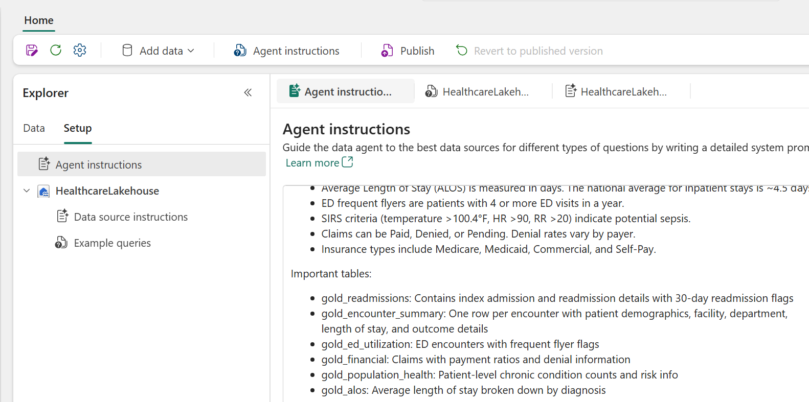
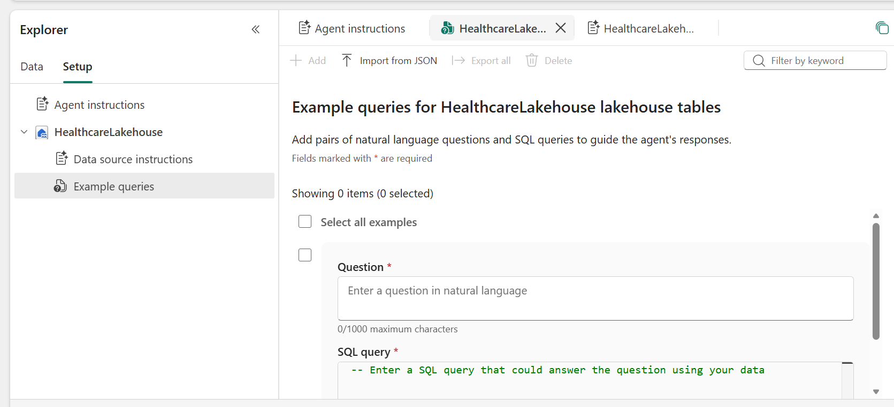

# Module 5: Data Agent

| Duration | 40 minutes |
|----------|------------|
| Objective | Prepare your semantic model for AI, then create a Fabric Data Agent that allows clinical and administrative staff to query healthcare data using plain English |
| Fabric Features | Prep Data for AI, Data Agent (AI Skill), Lakehouse integration |

---

## Why a Data Agent?

Healthcare organizations have data everywhere — claims, encounters, patient records, quality metrics — but the people who need answers most (clinicians, quality managers, finance directors) often **can't write SQL queries.**

A Data Agent bridges this gap. Instead of:
```sql
SELECT facility_name, AVG(length_of_stay_days) 
FROM gold_encounter_summary 
WHERE encounter_type = 'Inpatient' 
GROUP BY facility_name
```

A care manager simply asks:
> "What is the average length of stay for inpatient encounters at each facility?"

The Data Agent translates natural language into queries, runs them, and returns the answer — all within the governance framework of Microsoft Fabric.

---

## What You Will Do

1. Create a **Data Agent** in your workspace
2. Configure it to use your Lakehouse tables
3. Add **instructions** so it understands healthcare context
4. Test with clinical and operational questions
5. Share with your team

> **Prerequisite:** You should have already completed the "Prep Data for AI" steps in Module 3 (Steps 6–8), which added descriptions, AI instructions, and marked your semantic model as approved for Copilot.

---

## Part A: Create the Data Agent

### Step 1: Create a New Data Agent

1. Go to your workspace
2. Click **+ New item**
3. Search for and select **Data Agent** (it may appear as **AI Skill** in some tenants)
4. Name: `HealthFirst Clinical Analyst`
5. Click **Create**

### Step 2: Select Data Sources

After the Data Agent is created, you'll see the **"Build your data agent"** screen:


1. Click **Add data** in the toolbar (or the **"Add a data source"** card)
2. From the dropdown, select **Data source**
3. Select your **HealthcareLakehouse**
4. Choose the following tables (select all Gold and Silver tables):

**Gold layer tables (primary):**
- `gold_readmissions`
- `gold_ed_utilization`
- `gold_encounter_summary`
- `gold_alos`
- `gold_financial`
- `gold_population_health`

**Silver layer tables (supplemental):**
- `silver_patients`
- `silver_encounters`
- `silver_conditions`
- `silver_medications`
- `silver_claims`

**AI-enriched table (if created in Module 6):**
- `gold_clinical_ai_insights`

5. Click **Confirm** to add all selected tables

---

## Part B: Configure the Agent — Setup Tab

After adding your data source, switch to the **Setup** tab in the left Explorer pane. You'll see three configuration areas:
- **Agent instructions** — overall guidance for the agent
- **Data source instructions** (under HealthcareLakehouse) — context about this specific data source
- **Example queries** (under HealthcareLakehouse) — natural language + SQL pairs to guide responses

### Step 3: Add Agent Instructions

The Data Agent performs much better when it understands the healthcare context.

1. In the **Explorer** pane (left side), click the **Setup** tab
2. Click **Agent instructions**
3. In the instructions text box, paste the following:



```
You are a clinical data analyst for HealthFirst Medical Group, a healthcare 
network with three facilities: Metro General Hospital, Community Medical Center, 
and Riverside Health Center.

You help clinicians, quality managers, and administrators answer questions about 
patient outcomes, operational metrics, and financial performance.

Key domain knowledge:
- A "readmission" means a patient returned to the hospital within 30 days of 
  a prior inpatient discharge. The national readmission rate is ~15%.
- CMS penalizes hospitals with excessive readmissions under the HRRP program.
- Average Length of Stay (ALOS) is measured in days. The national average for 
  inpatient stays is ~4.5 days.
- ED frequent flyers are patients with 4 or more ED visits in a year.
- SIRS criteria (temperature >100.4°F, HR >90, RR >20) indicate potential sepsis.
- Claims can be Paid, Denied, or Pending. Denial rates vary by payer.
- Insurance types include Medicare, Medicaid, Commercial, and Self-Pay.

Important tables:
- gold_readmissions: Contains index admission and readmission details with 
  30-day readmission flags
- gold_encounter_summary: One row per encounter with patient demographics, 
  facility, department, length of stay, and outcome details
- gold_ed_utilization: ED encounters with frequent flyer flags
- gold_financial: Claims with payment ratios and denial information
- gold_population_health: Patient-level chronic condition counts and risk info
- gold_alos: Average length of stay broken down by diagnosis

When answering:
- Always specify which facility or facilities the data covers
- Include relevant counts (N=) alongside percentages
- Flag any quality concerns (e.g., readmission rate above 15%)
- If comparing facilities, present results in a table format
```

### Step 4: Add Data Source Instructions

Data source instructions provide context specific to the **HealthcareLakehouse** — telling the agent what's in this data source and how to use it.

1. In the **Explorer** pane under **HealthcareLakehouse**, click **Data source instructions**
2. You'll see two fields: **Data source description** and **Data source instructions**


3. In the **Data source description** field, enter:
```
Healthcare operational data for a 3-facility hospital network. Contains patient encounters, 
clinical outcomes (readmissions, length of stay), financial claims, ED utilization patterns, 
and population health metrics. Covers data from January 2024 through March 2026.
```

4. In the **Data source instructions** field, enter:
```
This Lakehouse contains Gold-layer analytics tables and Silver-layer detail tables.

Gold tables (use for aggregated analytics):
- gold_readmissions: 30-day readmission flags. Key columns: patient_id, index_facility, 
  index_diagnosis, was_readmitted, days_to_readmission
- gold_encounter_summary: One row per encounter. Key columns: encounter_type (ED, Inpatient, 
  Outpatient, Ambulatory), facility_name, department, length_of_stay_days, total_charges
- gold_financial: Claims data. Key columns: payer, claim_amount, paid_amount, denied_amount, 
  claim_status (Paid, Denied, Paid on Appeal)
- gold_ed_utilization: ED visit patterns. Key columns: ed_visit_count, is_frequent_flyer
- gold_population_health: Chronic condition counts. Key columns: chronic_condition_count, 
  multimorbidity (None, Moderate, High)
- gold_alos: Length of stay analytics by diagnosis and facility

Silver tables (use for patient-level detail):
- silver_patients: Demographics (age, gender, race, insurance_type, risk_score)
- silver_encounters: Raw encounter records
- silver_conditions: ICD-10 diagnosis codes per patient
- silver_medications: Medication orders and classes
- silver_claims: Individual claim line items

Join patterns:
- Join gold tables to silver_patients on patient_id for demographic breakdowns
- Join gold_financial to gold_encounter_summary on encounter_id for clinical+financial analysis
```

### Step 5: Add Example Queries

Example queries teach the agent how to translate natural language questions into SQL. Each example is a pair: a **Question** (natural language) and a **SQL query** (the correct answer).

1. In the **Explorer** pane under **HealthcareLakehouse**, click **Example queries**
2. Click **+ Add** to create each example query pair



Add the following example query pairs:

#### Example 1: Readmission Rate
**Question:**
```
What is our overall 30-day readmission rate?
```
**SQL query:**
```sql
SELECT 
    COUNT(CASE WHEN was_readmitted = true THEN 1 END) * 100.0 / COUNT(*) AS readmission_rate_pct,
    COUNT(*) AS total_index_admissions,
    COUNT(CASE WHEN was_readmitted = true THEN 1 END) AS total_readmissions
FROM gold_readmissions
```

#### Example 2: Readmission Rate by Facility
**Question:**
```
Which facility has the highest readmission rate?
```
**SQL query:**
```sql
SELECT 
    index_facility,
    COUNT(CASE WHEN was_readmitted = true THEN 1 END) * 100.0 / COUNT(*) AS readmission_rate_pct,
    COUNT(*) AS total_admissions
FROM gold_readmissions
GROUP BY index_facility
ORDER BY readmission_rate_pct DESC
```

#### Example 3: Average Length of Stay
**Question:**
```
What is the average length of stay for inpatient encounters by facility?
```
**SQL query:**
```sql
SELECT 
    facility_name,
    AVG(length_of_stay_days) AS avg_los_days,
    COUNT(*) AS inpatient_count
FROM gold_encounter_summary
WHERE encounter_type = 'Inpatient' AND length_of_stay_days > 0
GROUP BY facility_name
ORDER BY avg_los_days DESC
```

#### Example 4: Denial Rate by Payer
**Question:**
```
What is our claims denial rate by payer?
```
**SQL query:**
```sql
SELECT 
    payer,
    COUNT(CASE WHEN claim_status = 'Denied' THEN 1 END) * 100.0 / COUNT(*) AS denial_rate_pct,
    SUM(CASE WHEN claim_status = 'Denied' THEN claim_amount ELSE 0 END) AS revenue_lost_to_denials,
    COUNT(*) AS total_claims
FROM gold_financial
GROUP BY payer
ORDER BY denial_rate_pct DESC
```

#### Example 5: ED Frequent Flyers
**Question:**
```
How many ED frequent flyer patients do we have and what are their demographics?
```
**SQL query:**
```sql
SELECT 
    p.insurance_type,
    p.gender,
    COUNT(DISTINCT e.patient_id) AS frequent_flyer_count
FROM gold_ed_utilization e
JOIN silver_patients p ON e.patient_id = p.patient_id
WHERE e.is_frequent_flyer = true
GROUP BY p.insurance_type, p.gender
ORDER BY frequent_flyer_count DESC
```

3. After adding all examples, the agent will use these as reference patterns when generating SQL for similar questions

> **Tip:** The more example queries you provide, the more accurate the agent's SQL generation becomes. Focus on your most common use cases and queries that involve joins between tables.

---

## Part C: Test the Data Agent

### Step 6: Ask Clinical Questions

Switch to the **Data** tab in the Explorer pane to access the agent chat interface. Try these questions one at a time. Observe how the agent translates your question into a query and returns results.

#### Question 1: Readmission Overview
```
What is the overall 30-day readmission rate, and how does it break down by facility?
```

**Expected:** The agent queries `gold_readmissions`, calculates the readmission rate, and breaks it down by facility_name.

#### Question 2: Length of Stay
```
What is the average length of stay for inpatient encounters? 
Which diagnoses have the longest stays?
```

**Expected:** The agent uses `gold_encounter_summary` or `gold_alos` to show ALOS with a breakdown by diagnosis.

#### Question 3: ED Utilization
```
How many patients visited the ED more than 3 times this year? 
What are their most common diagnoses?
```

**Expected:** The agent queries `gold_ed_utilization` and joins with conditions to identify frequent flyers and their diagnoses.

#### Question 4: Financial Performance
```
What is our claims denial rate? Which payer has the highest denial rate, 
and how much revenue have we lost to denials?
```

**Expected:** The agent queries `gold_financial` to show denial rates and financial impact by payer.

#### Question 5: Population Health
```
How many patients have 3 or more chronic conditions? 
What percentage are on Medicare?
```

**Expected:** The agent queries `gold_population_health` and `silver_patients` for multimorbidity analysis.

#### Question 6: Cross-Facility Comparison
```
Compare Metro General Hospital and Community Medical Center across:
readmission rate, average length of stay, and ED volume
```

**Expected:** The agent queries multiple Gold tables and presents a comparative table.

### Step 7: Try Your Own Questions

Think about what a hospital administrator or quality officer would want to know, and ask the agent. Some ideas:

- "Which department has the most encounters?"
- "What percentage of our patients are uninsured?"
- "Are there any diagnoses where our ALOS is significantly above average?"
- "Show me the trend of encounters by month"
- "Which high-risk patients have diabetes AND heart failure?"

---

## Part D: Refine and Share

### Step 8: Iterate on Instructions

If the agent gives unexpected or incorrect answers:

1. Note what the agent got wrong
2. Update the **Instructions** with clarifications
3. Re-test the question

For example, if the agent confuses "readmission rate" with "readmission count," add:
```
When asked about "readmission rate," always return a percentage: 
(patients readmitted within 30 days / total index admissions) * 100
```

### Step 9: Share the Agent

1. Click the **Share** button in the agent settings
2. Add colleagues or groups who should have access
3. They can now use the agent from their Fabric workspace

> **Note:** Users accessing the Data Agent will only see data they have permissions to access through Fabric's built-in security model.

---

## 💡 Discussion: AI-Powered Analytics in Healthcare

**Impact Scenarios:**
- **Quality Director:** "Show me readmission rates for CHF patients by facility" → Instant insight instead of waiting for IT to run a report
- **CFO:** "How much revenue did we lose to claim denials last quarter?" → Real-time financial visibility
- **Board Presentation:** Use Copilot to generate executive narratives and visuals directly from the data

**Governance Considerations:**
- Data Agents respect Fabric workspace permissions (row-level security, table access)
- All queries are logged and auditable
- PHI (Protected Health Information) stays within the Fabric environment
- HIPAA compliance is maintained through Azure's compliance certifications

**Discussion Questions:**
1. Who in a hospital would benefit most from a Data Agent?
2. What safeguards should exist when non-technical users query patient data?
3. How does this approach compare to traditional BI report distribution?
4. What happens if the AI generates an incorrect response — what guardrails are needed?

---

## ✅ Module 5 Checklist

Confirm you have completed:

- [ ] Prep Data for AI configured in Module 3 (descriptions, AI Instructions, Approved for Copilot)
- [ ] Data Agent `HealthFirst Clinical Analyst` is created
- [ ] Lakehouse tables are connected as data sources
- [ ] Data source description and instructions added
- [ ] Example queries added (5 question/SQL pairs)
- [ ] Agent instructions added with healthcare domain context
- [ ] Successfully tested at least 4 natural language queries with the Data Agent
- [ ] The agent returns accurate, well-formatted responses

---

**[← Module 4: Real-Time Analytics](Module04_RealTime_Analytics.md)** | **[Module 6: Gen AI — Clinical Intelligence →](Module06_GenAI_Clinical_Intelligence.md)**
